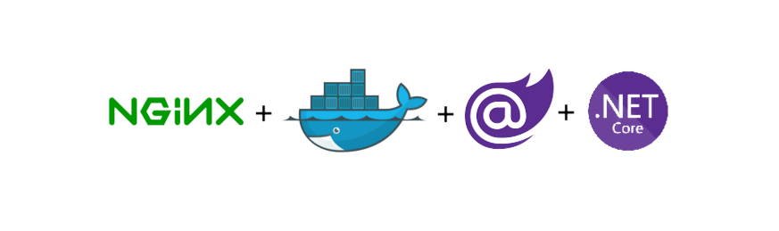

# Execute o Blazor Web Assembly no Docker!

  

This project is a Demo to run blazor web assembly with docker. The project follows an organized and easy-to-maintain structure.

---

## Features

- Introduction to Blazor
- Development environment setup
- Using Docker as a container orchestrator
- Using Nginx as a server

## Installation

To use this project, you need to follow these steps:

1. Clone the repository: `git clone https://github.com/username/repo-name.git`

## Docker

This project includes a `Dockerfile` and `nginx.conf` file for easy containerization and deployment. Here are the most common Docker commands you might want to use:

- `docker build -t your-image-name --build-arg Environment=Production .`: Build a Docker image for the project. Replace `your-image-name` with a name for your image. You can change the environment if necessary.
- `docker run --name your-image-name -d -p 5002:8080 --rm your-image-name`: Run a container based on the built image. Replace `your-image-name` with the name you used when building the image.

For more information on Docker and Nginx, refer to the official documentation:

- [Docker](https://docs.docker.com/)
- [Nginx](https://docs.nginx.com/)

## Used Tools

This project uses the following tools:

- [Blazor](https://dotnet.microsoft.com/pt-br/apps/aspnet/web-apps/blazor) for frontend development

## Contributing

To contribute to this project, please follow these guidelines:

1. Fork the repository
2. Create a new branch: `git checkout -b feature/your-feature-name`
3. Make your changes and commit them using Conventional Commits
4. Push to the branch: `git push origin feature/your-feature-name`
5. Submit a pull request

---

## License

This project is licensed under the MIT License - see the LICENSE.md file for details.

## Credits

This project was created by [Erismar Oliveira](https://github.com/erismaroliveira).
